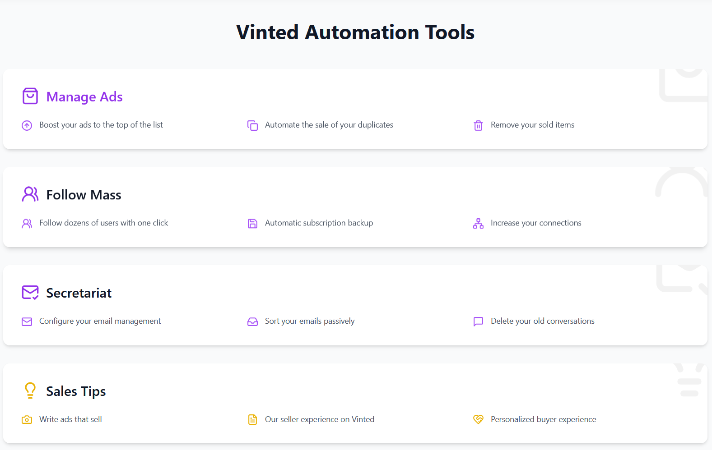
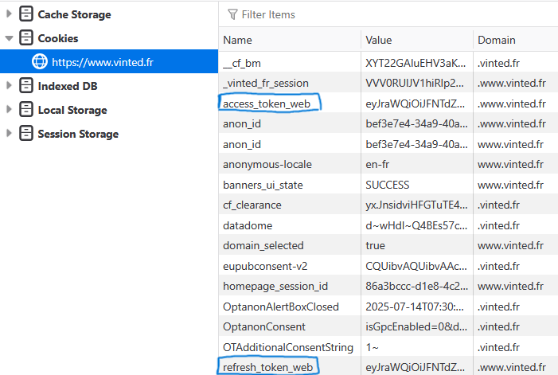
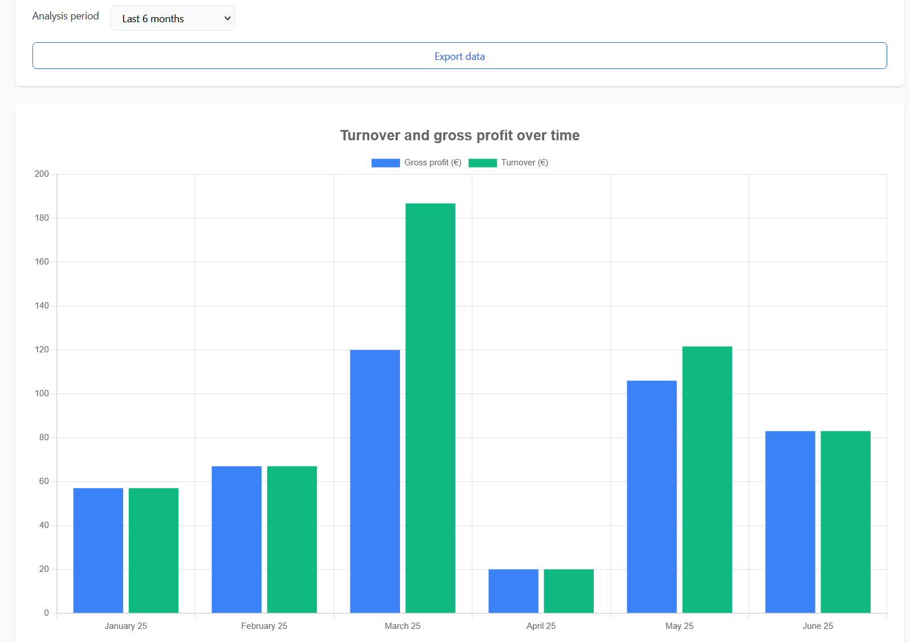

# Vinted Management Tool

This branch is a refactored version of smtg I did in 2023 (that used to work)
Vinted uses SSR and makes refresh ads features a huge pain,
Luckily they are creating an API for pro sellers (closed access only): https://pro-docs.svc.vinted.com/

## Preview

### Main Interface


### Setup Process
1. Login into your vinted account
2. Copy tokens in http://localhost:5173/settings



### Sales Analytics


## Getting Started

### Prerequisites for Non-Developers

Before starting, you'll need to install:

- [Node.js](https://nodejs.org/en/download)
- [Python](https://www.python.org/)

### First Time Setup

```bash
cd frontend
npm install

cd ../backend
pip install -r requirements.txt
```

### Running the Application

```bash
# Start Frontend (Development)
cd frontend
npm run dev
# OR for Production
npm run build
npm run preview # Access at http://localhost:4173/

# Start Backend (in another terminal)
cd backend
fastapi dev main.py
```

> **Note**: A Docker version might be released in the future to simplify setup for non-developers.

## Features Status

| Feature                | Description                                              | Status               |
| ---------------------- | -------------------------------------------------------- | -------------------- |
| English translation    | Add a language switcher button + i18n translations       | ✅ Done              |
| Conversation Cleanup   | Auto-delete conversations after x months of inactivity   | ✅ Done              |
| Ad Refresh             | Automatic refreshing of listings                         | ❌ Good luck         |
| Sales Analytics        | Export transactions, generate graphs & statistics        | ✅ Done              |
| Favorite Messages      | Quick-copy system for 5 favorite messages                | ✅ Done              |
| Publication Menu       | Database-linked posting system with search functionality | 📝 To Be Done        |
| Shipping Labels        | Automatic retrieval of shipping labels                   | ⚠️ Not Planned       |
| Thank You Messages     | Add customizable thank-you messages on shipping labels   | ⚠️ Not Planned       |
| Feedback System        | Random automated feedback for transactions               | ⚠️ Not Planned       |
| Like Notifications     | Auto-send notifications to users who liked an item       | ⚠️ Not Planned       |
| Auto Purchase Response | Automatic message when a buyer purchases an item         | ⚠️ Not Planned       |
| Item Database          | Auto re upload for items with multiple copies            | ❌ Good luck         |

## Legal Notice

This tool is for personal use only and must comply with Vinted's terms of service. Any automated data collection must respect platform policies and user privacy.
